# Abalone Data Analysis and Regression Modeling

## 1. Project Description

This project presents an exploratory data analysis and statistical modeling study performed on the Abalone dataset. The primary goal of the analysis was to investigate relationships between the physical dimensions of abalones, particularly focusing on the relationship between `Length` and `Whole Weight`.

The project includes:

- Exploratory Data Analysis (EDA)
- Distribution analysis using histograms and boxplots
- Descriptive and moment-based statistics
- Outlier detection and removal using the IQR method
- Data transformation techniques
- Linear regression modeling
- Residual diagnostics and statistical validation
- Correlation analysis
- Group segmentation by sex

## 2. Data Source

The analysis was conducted using the **Abalone Dataset**, a widely used dataset for predictive modeling and statistical analysis tasks.

Dataset source:

- UCI Machine Learning Repository  
- https://archive.ics.uci.edu/ml/datasets/abalone

The dataset contains physical measurements of abalones, including:

- Sex
- Length
- Diameter
- Height
- Whole Weight
- Shucked Weight
- Viscera Weight
- Shell Weight
- Rings

## 3. Tech Stack and Methodology

### Tech Stack

- **Python**
- **Pandas** — data manipulation
- **NumPy** — numerical operations
- **Matplotlib** — plotting and visualization
- **Seaborn** — statistical visualizations
- **SciPy** — statistical analysis
- **Statsmodels / Scikit-learn** — regression modeling

### Methodology

The workflow followed these main steps:

1. Initial exploratory data analysis
2. Visualization of distributions and relationships
3. Statistical characterization of variables
4. Detection and removal of outliers using the IQR method
5. Variable transformation for regression suitability
6. Linear regression modeling
7. Residual diagnostics:
   - Residual plots
   - Normality checks
   - QQ plots
   - Independence testing
8. Correlation analysis
9. Group segmentation analysis based on categorical variables

The final model used the cube root transformation of the `Whole Weight` variable to achieve linearity and improve regression performance.

## 4. Repository Contents

```text
├── plots/
│   ├── 2.png
│   ├── 3.png
│   ├── 4.png
│   ├── 5.png
│   ├── 6.png
│   ├── 7.png
│   ├── 8.png
│   ├── 9.png
│   ├── 10.png
│   ├── 11.png
│   ├── 12.png
│   ├── 13.png
│   ├── 14.png
│   ├── 15.png
│   ├── 16.png
│   └── 17.png
│
├── abalone_da.ipynb
│
├── report.pdf
│
└── README.md
```

---

## 5. Plots

### Index Plots

#### Length Index Plot
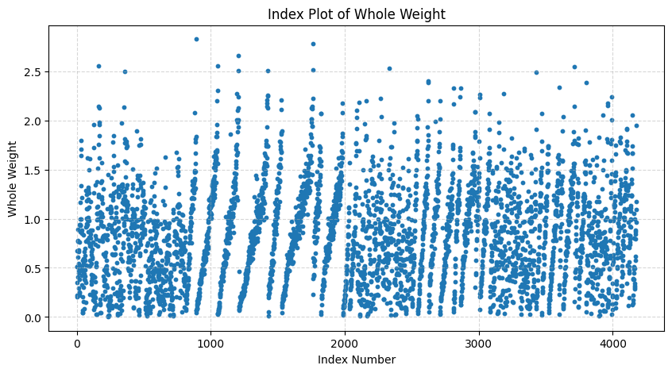

#### Whole Weight Index Plot
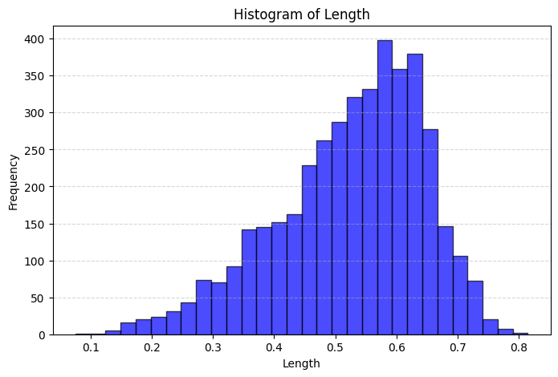

---

### Distribution Analysis

#### Length Boxplot and Histogram
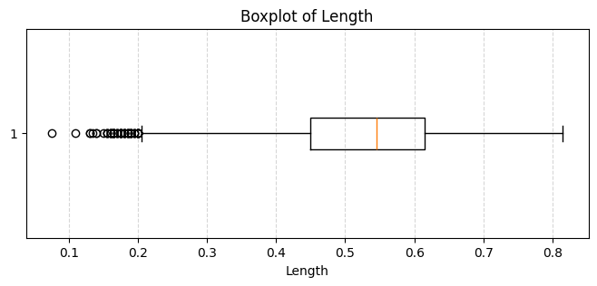

#### Whole Weight Boxplot and Histogram
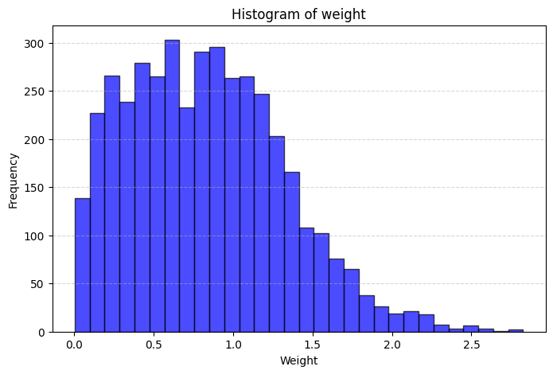

---

### Scatterplot Analysis

#### Whole Weight vs Length
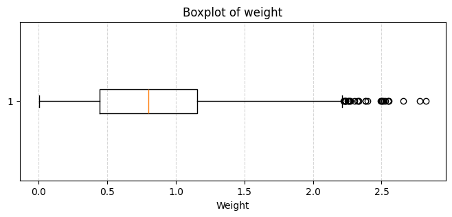

---

### Outlier Analysis

#### Outlier Detection
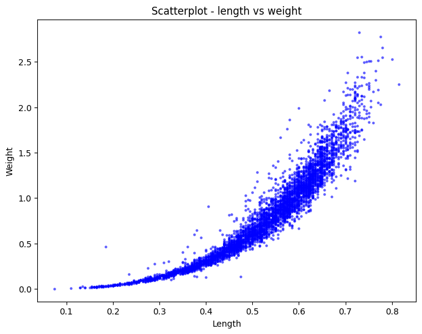

#### Dataset After Outlier Removal
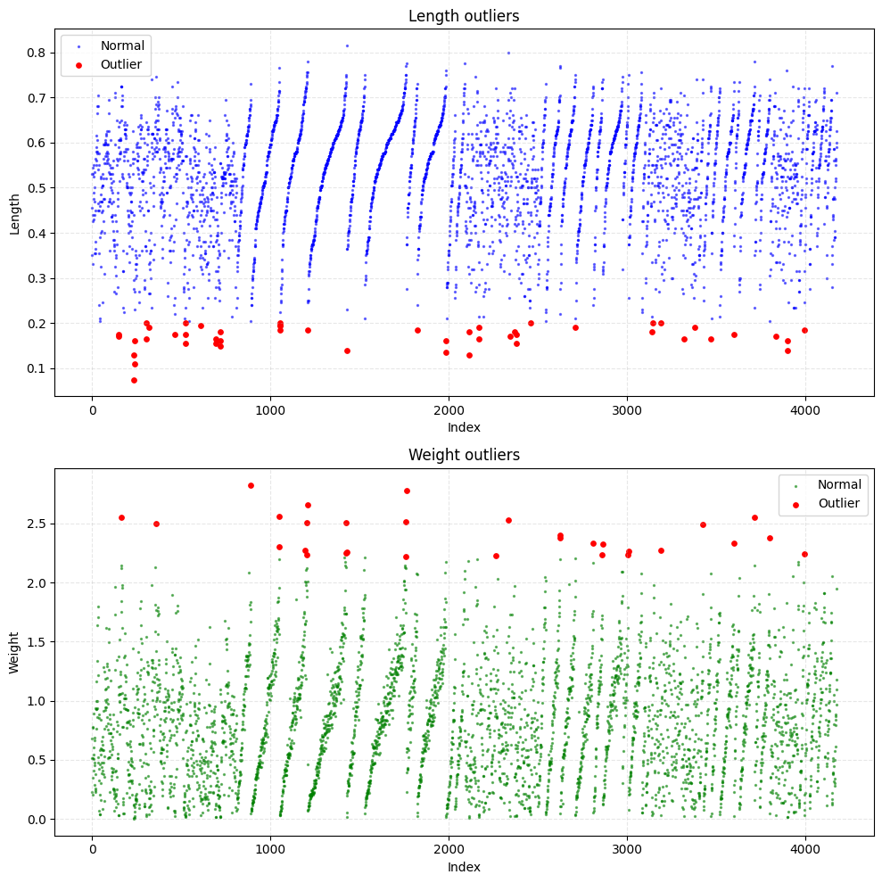

---

### Data Transformation

#### Cube Root Transformation
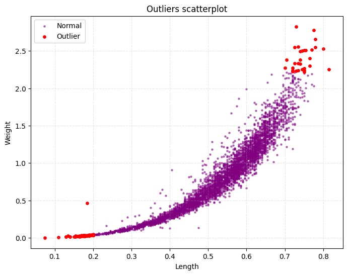

#### Logarithmic Transformation
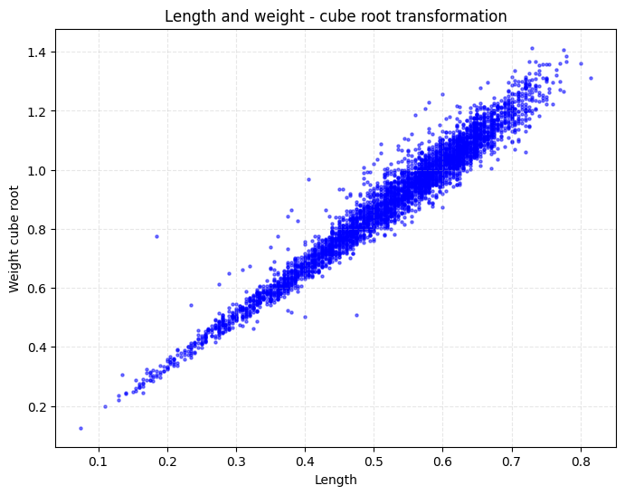

---

### Regression Modeling

#### Linear Regression Model
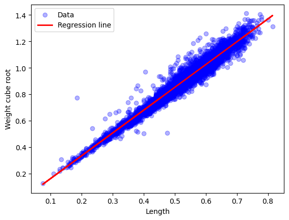

---

### Residual Diagnostics

#### Residual Plot
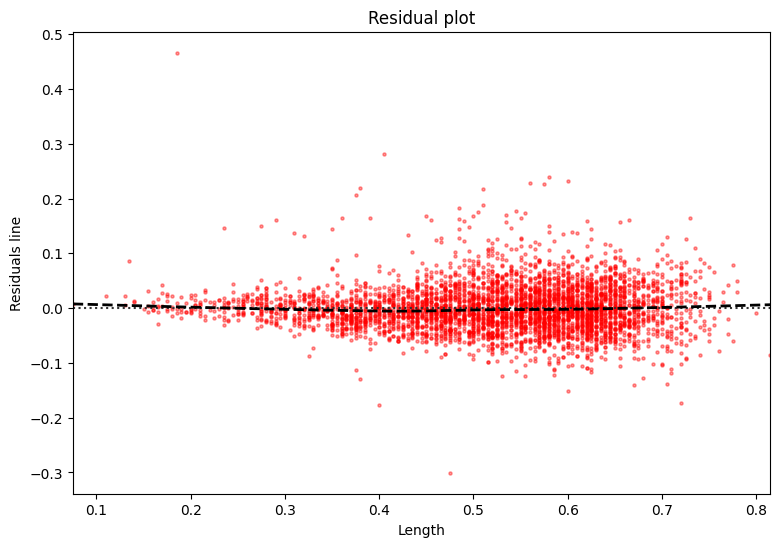

#### Residual Histogram
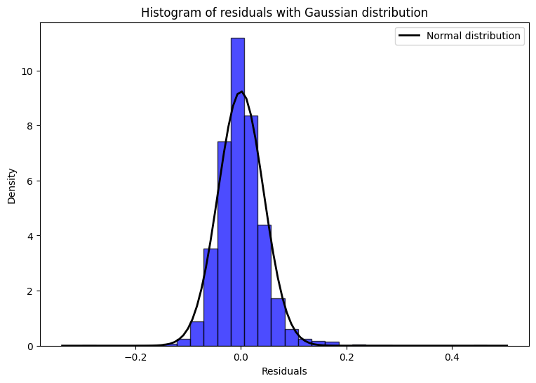

#### QQ Plot
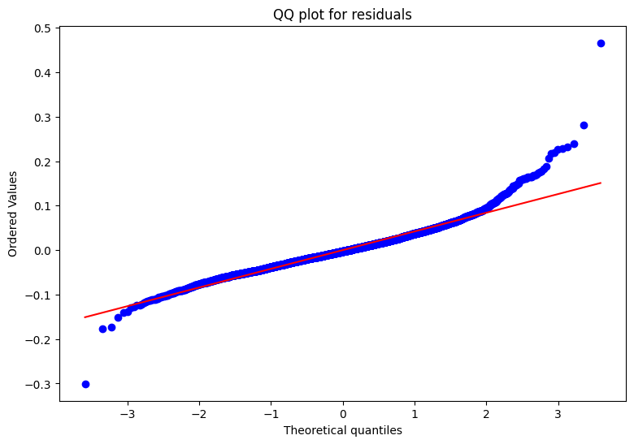

#### Autocorrelation Plot
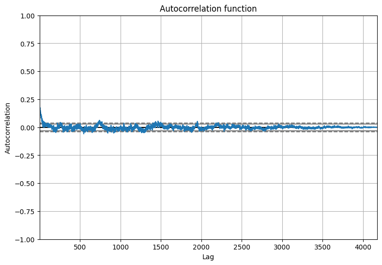

---

### Group Segmentation

#### Segmentation by Sex
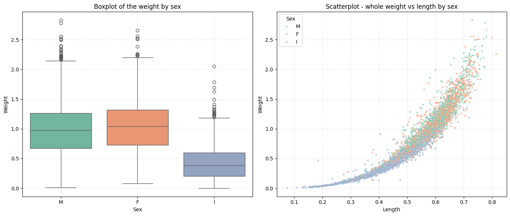

---

### Correlation Analysis

#### Correlation Heatmap
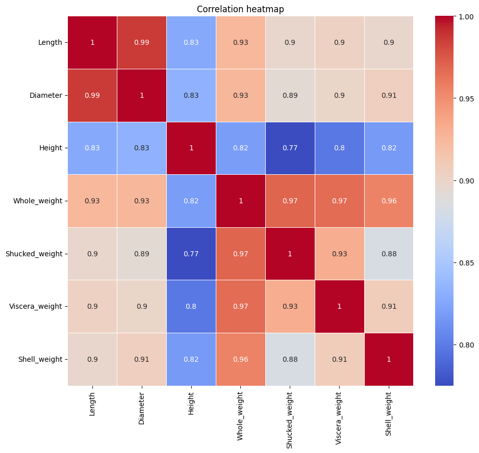
